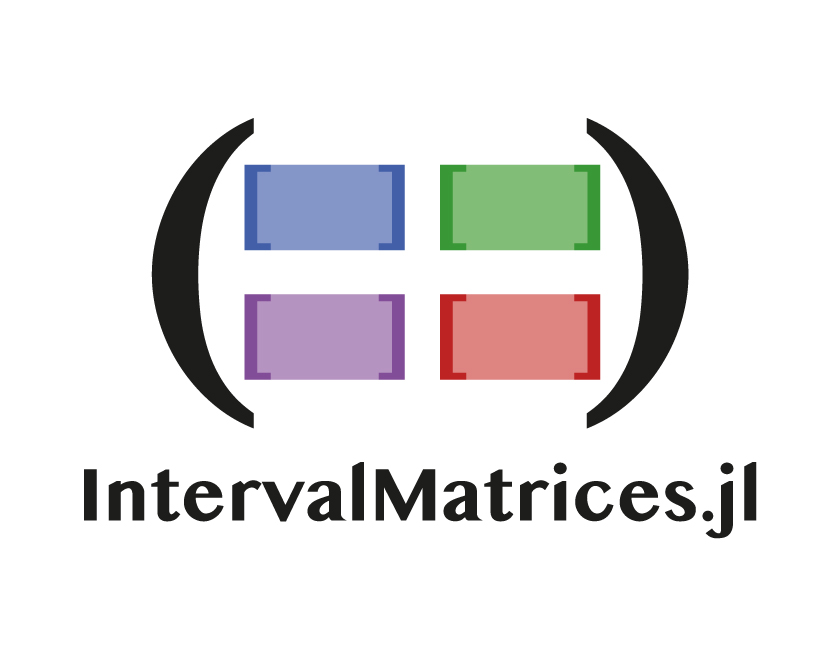

# IntervalMatrices.jl

| **Documentation** | **Status** | **Community** | **Version-Specific Citation** | **License** |
|:-----------------:|:----------:|:-------------:|:-----------------------------:|:-----------:|
| [![docs-dev][dev-img]][dev-url] | [![CI][ci-img]][ci-url] [![codecov][cov-img]][cov-url] [![PkgEval][pkgeval-img]][pkgeval-url] [![aqua][aqua-img]][aqua-url] | [![zulip][chat-img]][chat-url] [![JuliaHub][juliahub-img]][juliahub-url] | [![DOI][doi-img]][doi-url] | [![license][lic-img]][lic-url] |

[dev-img]: https://img.shields.io/badge/docs-latest-blue.svg
[dev-url]: https://juliareach.github.io/IntervalMatrices.jl/dev/
[ci-img]: https://github.com/JuliaReach/IntervalMatrices.jl/workflows/CI/badge.svg
[ci-url]: https://github.com/JuliaReach/IntervalMatrices.jl/actions/workflows/test-master.yml
[cov-img]: https://codecov.io/github/JuliaReach/IntervalMatrices.jl/coverage.svg
[cov-url]: https://app.codecov.io/github/JuliaReach/IntervalMatrices.jl
[pkgeval-img]: https://juliaci.github.io/NanosoldierReports/pkgeval_badges/I/IntervalMatrices.svg
[pkgeval-url]: https://juliaci.github.io/NanosoldierReports/pkgeval_badges/I/IntervalMatrices.html
[aqua-img]: https://raw.githubusercontent.com/JuliaTesting/Aqua.jl/master/badge.svg
[aqua-url]: https://github.com/JuliaTesting/Aqua.jl
[chat-img]: https://img.shields.io/badge/zulip-join_chat-brightgreen.svg
[chat-url]: https://julialang.zulipchat.com/#narrow/stream/278609-juliareach
[juliahub-img]: https://juliahub.com/docs/General/IntervalMatrices/stable/version.svg
[juliahub-url]: https://juliahub.com/ui/Packages/General/IntervalMatrices
[doi-img]: https://zenodo.org/badge/116675366.svg
[doi-url]: https://zenodo.org/badge/latestdoi/116675366
[lic-img]: https://img.shields.io/github/license/mashape/apistatus.svg
[lic-url]: https://github.com/JuliaReach/IntervalMatrices.jl/blob/master/LICENSE

`IntervalMatrices.jl` is a [Julia](http://julialang.org) package to work with
matrices that have interval coefficients.

<p align="center">
    
</p>

## Resources

- [Manual](http://juliareach.github.io/IntervalMatrices.jl/latest/)
- [Releases](https://github.com/JuliaReach/IntervalMatrices.jl/releases)
- [Developers](https://juliareach.github.io/IntervalMatrices.jl/latest/about/#Credits-1)
- [Contributing](https://juliareach.github.io/IntervalMatrices.jl/latest/about/#Contributing-1)

## Installing

This package requires Julia v1.0 or later. Refer to the
[official documentation](https://julialang.org/downloads) on how to install and
run Julia on your system.

To install this package, run the following from the Julia REPL:

```julia
julia> import Pkg; Pkg.add("IntervalMatrices")
```

Other installation options can be found in the manual.

## Quickstart

A quickstart guide is available in [the documentation](https://juliareach.github.io/IntervalMatrices.jl/latest/#Quickstart).
